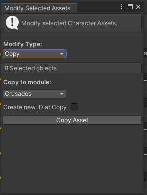

# Asset browsers

Each asset type, contain propertly assets browser. 
With navigation and filtering. You can, search, create, modify, copy or delete assets only in it.


```diff
! Important:                                                                                            
You dont move,rename, copy or delete assets, in unity assets herarchy.
All assets manipulation need to do with assets browser editors.
```


### - Filtering and Navigation
Every assety type contains specific sorting posibilites besides default "Sort by ID" &  "Sort by name".
For example for NPC, you can sort it by occupation or for Factions you can sort it by Kingdom.


You can search any prefab by selected Sort type


You can filer any asset type, by it most important properties.


#### - You can select select stack of assets
##### - Shift + Click from (define action, select/deselect) + Click to
&nbsp;


---------------------------------------------

### - Create Asset
You can create new assets/stacks, using this window


#### - Stack count
Number of created assets

#### - StacK ID
Stack start from specific count

#### - Use object reference
You can assign any object of asset type for use it as creation template.

#### - ID
New ID at creation.

---------------------------------------------

### - Modify Asset
You can modify selected assets/stacks, using this window


### - Edit Mode
You can change ID for existed assets (no links replacement, [see here](tips.md#--properties-windows))

#### - Edit as Copy
Create new asset at modify, with new ID. 
Else, modify directly selected assets.

#### - Stack count
Number of created assets

#### - StacK ID
Stack start from specific count

### - Copy Mode
You can copy selected assets to any imported module.



### - Remove Mode
You can remove selected assets from current module.


---------------------------------------------
#### [Common Info -->](tips.md)
#### [<-- Translation Tools](translations.md)

#### [Main Page](/../..)
