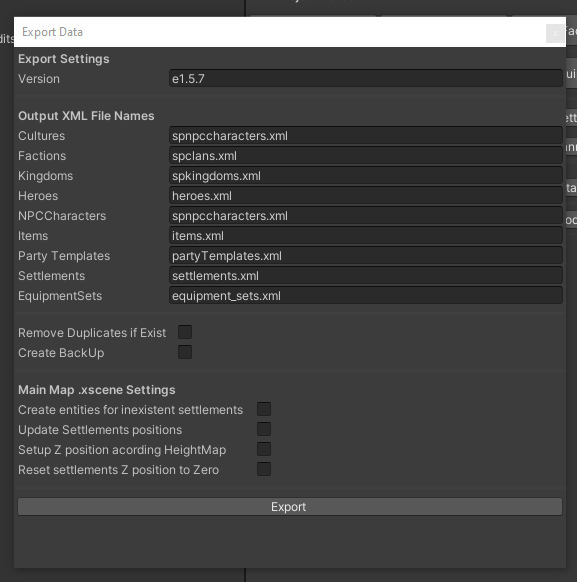

# Exporting Process



### - Version
The version of exported module

### - Output XML File names
Specify XML names for assets types to export it

### - Remove dublicates if exist
Remove all duplicates in other module files. 
e.g. if you imported NPCCharacters from my_xml_1.xml, 
and export it now to my_xml_2.xml Wil be deleted from my_xml_1.xml

### - Create BackUp (recomended)
BackUp before export your module and .xscene file to:
```diff                                                                                           
../Mount & Blade II Bannerlord/Modules/_BDT_BackUPs/mod_name/mod_name+mod_version+count
```

### - xscene Exporting
If your module have main map scene, you can export it data.

### - Create entities for unexistent settlemets
If you create new settlement in data and .xscene dont contains it.
It be created in .xscene, depending of specified type (town, castle,vllage, hideout)

##### Custom entity
You can change the hosted entity, adding yours customs template for each settlement type;
```diff 
+ MapSettlementsTemplates.xml
Assets/Settings/Definitions/MapSettlementsTemplates.xml
```
(Images/wp_editor/custom_entity.PNG)

### - Update settlements positions
Write X,Y settlements position data

### - Setup Z positions according Heightmap
Write Z settlements position data

### - Reset settlements Z positions to zero
Write Z settlements position data as 0.0 

---------------------------------------------
#### [<-- Common Info](tips.md)

#### [Main Page](/../..)