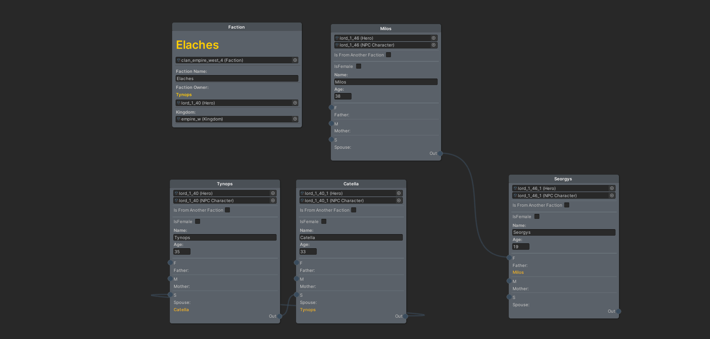
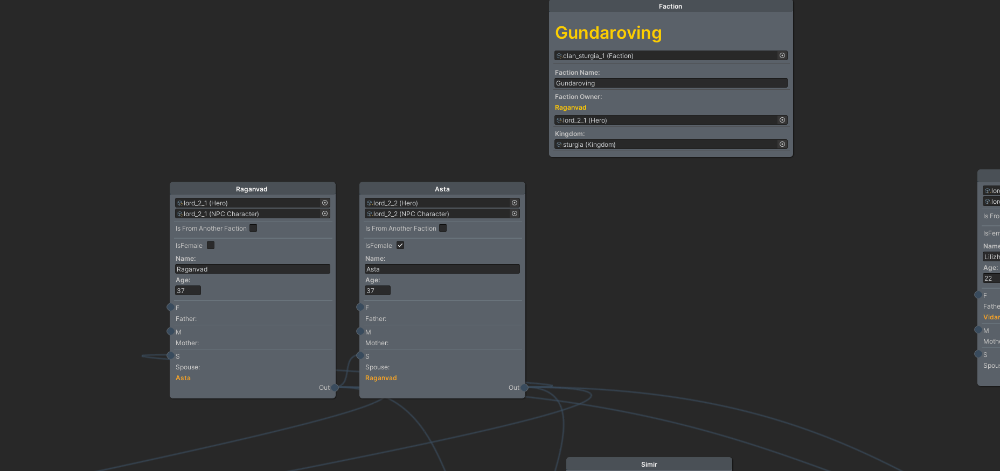
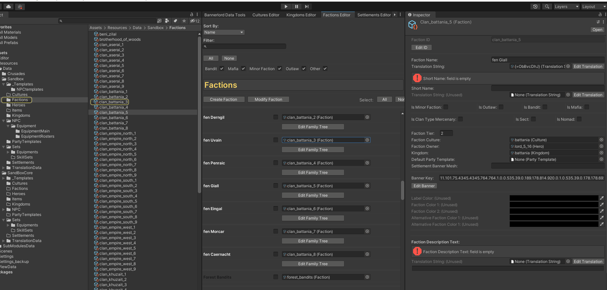

# Family Tree Editor

You can edit family tree, for each faction (clan) and between they. 
Using nodes system.
##### Use MMB to scroll canvas



#### - Adding nodes to working tree
You can add every hero data to node tree, if they are from another faction will be marked as "From another Faction".
And you will be edit only not occupied slots.

.

```diff
! Note:                                                               
At first opening faction tree, data will be generated automatically.
May be some nodes, are scattered distant from center.
```


---------------------------------------------
#### [WorldPosition Editor -->](world_pos.md)
#### [<-- PartyTemplate](pt_asset.md)

#### [Main Page](/../..)
