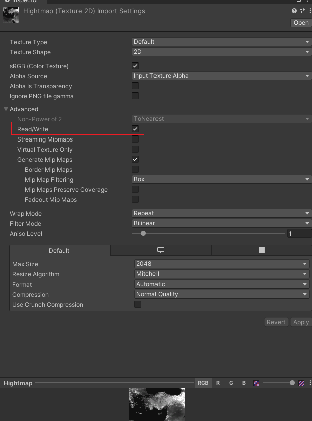

# Importing & module configuration


### Import module and dependencies
#### - Is recomended import all dependencies if not imported


```diff
! Note:                                                                                            
First time importing procces may be take (1 - 3) hours if you import Sandbox & SandboxCore modules.
Its create asset file for every imported data.
If you reimport or update modules version is more, more quickly.
```

#### - You can switch between imported modules using (Module Receiver)


### Setup module settings
##### All of this data need be setted for properly work of [World Position editor](README.md)
&nbsp;


#### - World map texture
Used for [World Position editor](world_pos.md) base canvas, this texture is for schematic view ow your world.

#### - Heightamp texture
Used in [Export](export.md) for elevate your positioned settlements by Z, according heightmap. 
If not exist, you can write only X,Y for settlements positions.

```diff
! Note:                                                                                   
Is a same height map texture you can used for scene terrain creation, in Bannerlord Mod Kit.
```

```diff
- Important!                                                                 
You need turn on Read/Write, for higtmap texture, in texture import settings.
```



#### - Load values from .xscene (main_scene file)
If your module contains Main_map scene. It can import map settings directly from .xscene


if you put it manually, its need to be according with your terrain properties


---------------------------------------------
#### [Culture asset -->](culture_asset.md)
#### [<-- Tools setup](tools_setup.md)

#### [Main Page](/../..)

