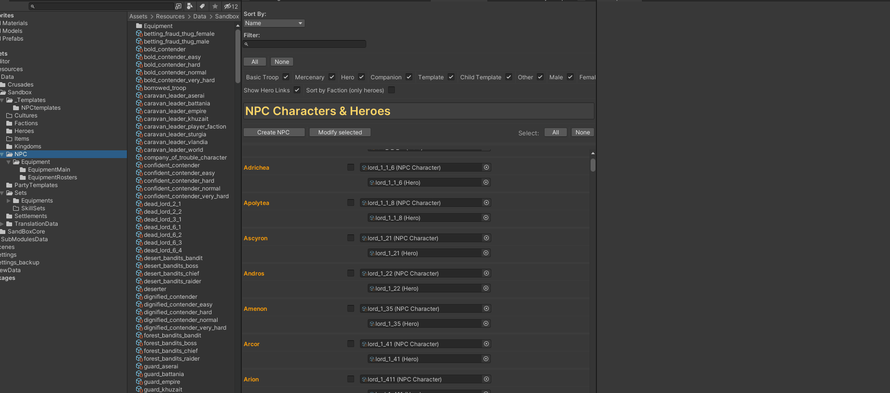
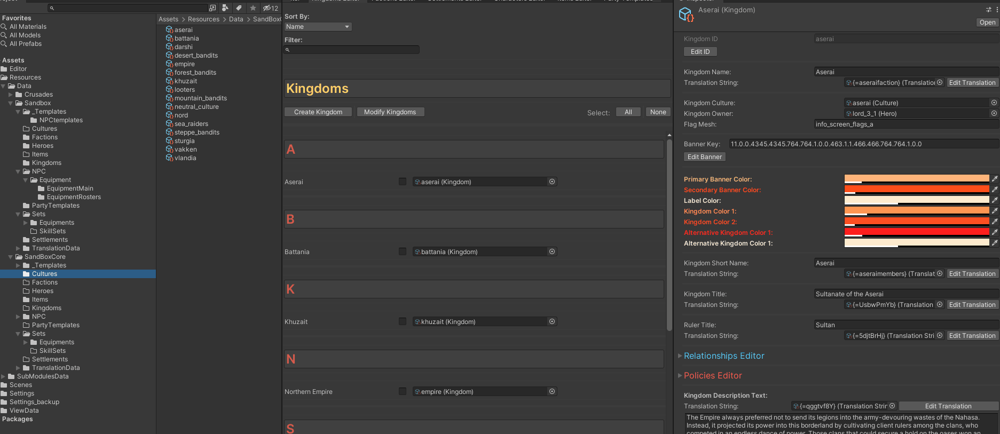
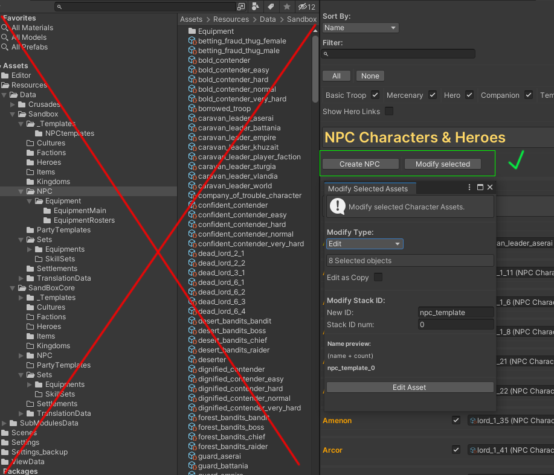
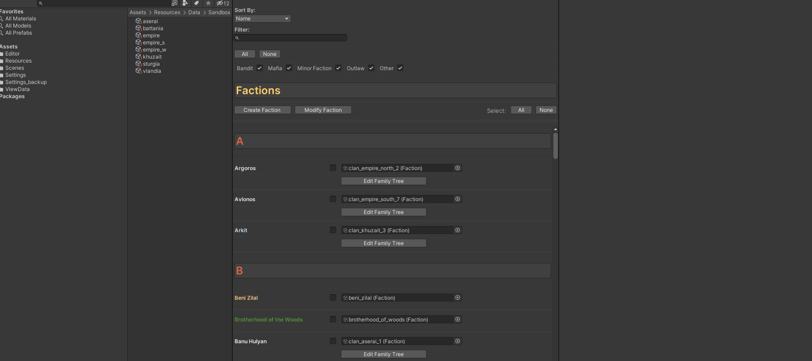
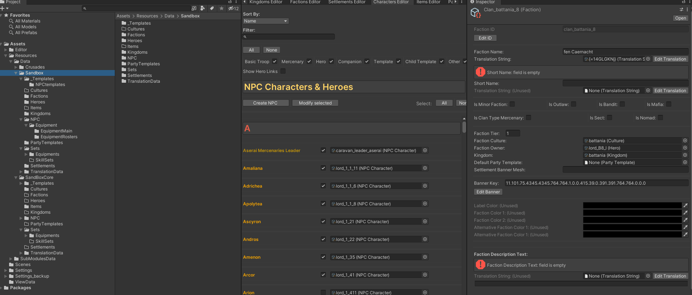
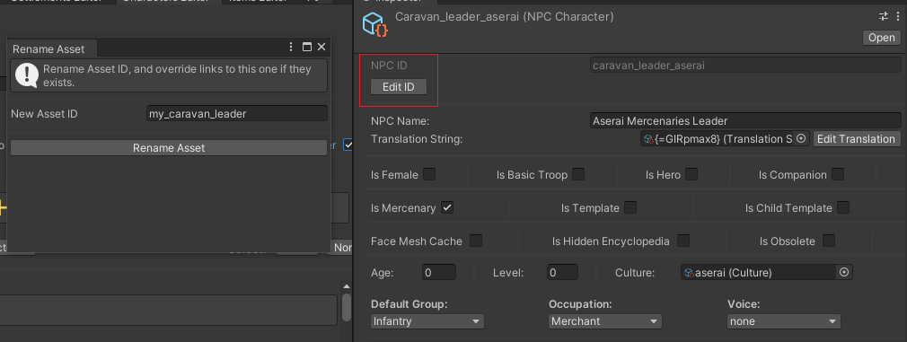
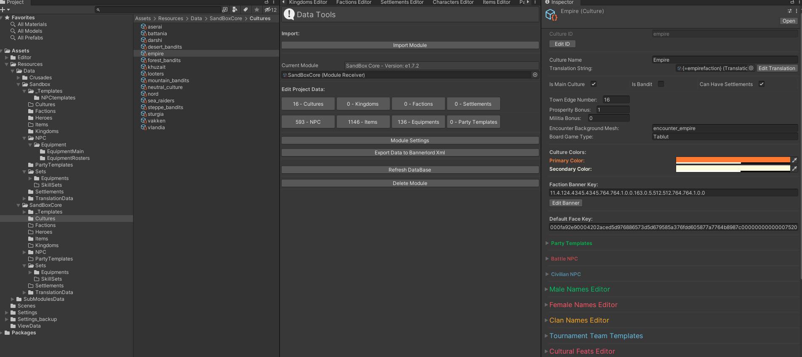

# Common information

```diff
! Note:                                                                          
All assets is saved automatically. But the tool still in development. 
I'm recommend use Ctrl+S along work and before exit Unity.
```

You can use unity browser to easy search and navigate in toons of bannerlord assets.



You can assign it directly from unity browser, to any field of asset type. 
Or simple select in slot button. 
If it exist in module or they dependencies it be assigned.



```diff
! Important:                                                                                            
You dont move,rename, copy or delete assets, in unity assets herarchy.
All assets manipulation need to do with assets browser editors.
```


### - Asset Selecting 
#### - One click - show asset in directory
#### - Double click - open it in inspector (editor)s



### - Debug mode
(recomended only for advanced users)
 At this version multi-component editor is unavailable, but you can use debug mode to edit multi selected assets. 
 Or view raw information data.



### - Special renaming with links replacement
You can change specified asset ID, and change it in all used assets who contains links to this one.



```diff
! Note:                                                                                            
In case if you renaming with Asset Browser --> Modify mode. The links wil not be replaced.
```
### - Properties Windows
You can open any asset, from any editor in new window tab RBM --> Properties. 
And easy organize your work layout.



#### - To reset layout go to BDT settings --> Load BDt Layout

---------------------------------------------
#### [Exporting process -->](export.md)
#### [<-- Asset Browsers](asset_browsers.md)

#### [Main Page](/../..)
