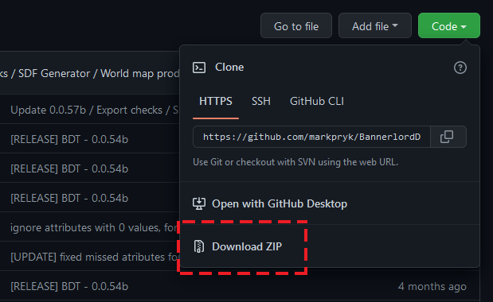

# Tools setup & project configuration

### Step 1

First at all you need to install anyone Unity3D version 2018+ (I am using now 2021.2)
#### - Best practice is using [UnityHub](https://unity3d.com/get-unity/download)

Download or clone repository.


### Step 2

#### - Open BDT as unity project.


#### - Open BDT Settings and configure
#### - Enter full path to bannerlord modules directory with / at final e.g ../Modules/


#### - Import native modules definitions to setup settings core data


```diff
! Note:                                                                                   
This progress may be take few minutes, is was importing data and create sriptable objects.
```

#### - After native data loaded, setup editor BDT layout


---------------------------------------------
#### [Importing Modules -->](importing_modules.md)

#### [Main Page](/../..)
