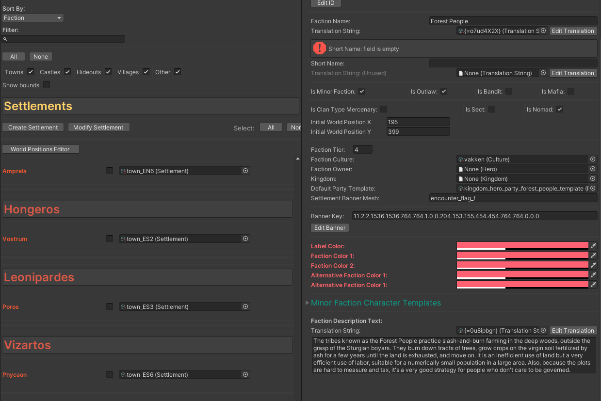

# Translation Tools

You can edit translation text fields what engine use for parse translation keys, also create it ones.

### Translation key generator
If the field no contains translation key string you can generate it automaticaly
and add data for all supported lenguages

.

### Key types
You can edit diferent key types. e.g. plural/singular

---------------------------------------------
#### [Asset Browsers -->](asset_browsers.md)
#### [<-- Banner Editor](banner_editor.md)

#### [Main Page](/../..)