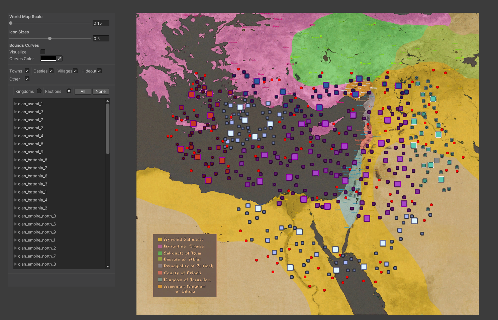
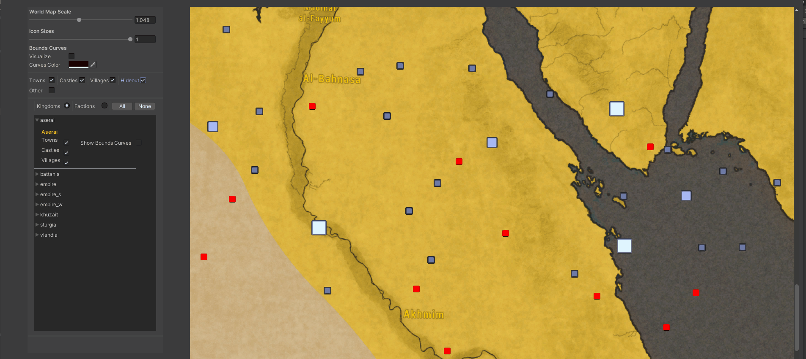
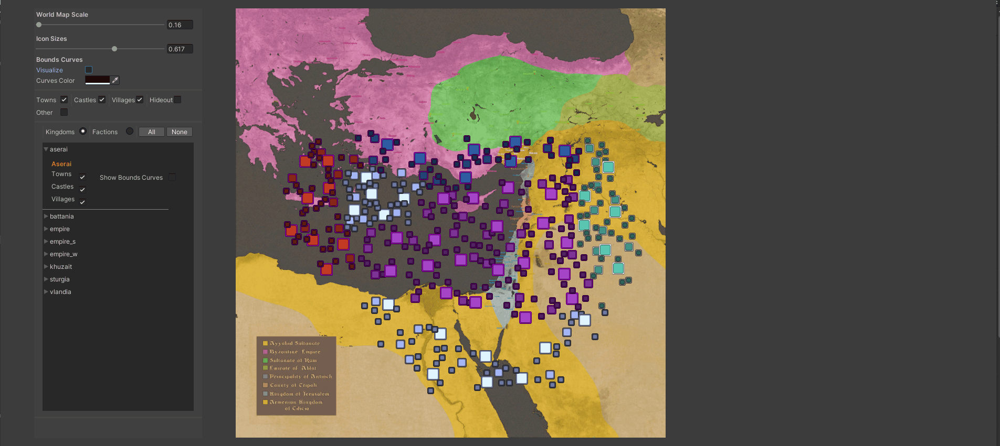
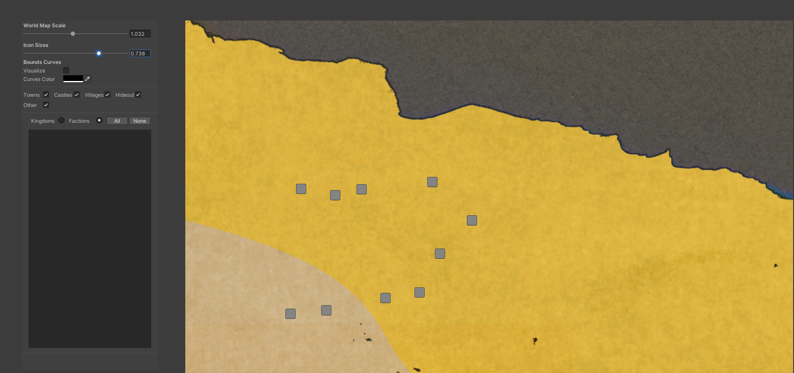
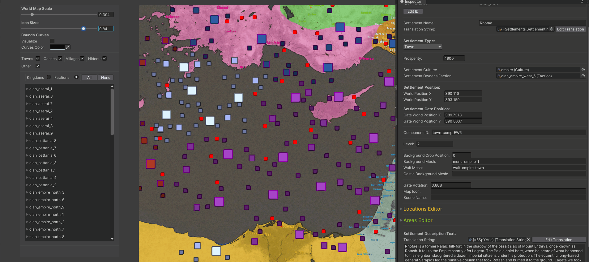

# World Position Editor

You can edit all 3D world settlements positions in this editor. 
With advanced filtering and vizualization.
##### Use MMB to scroll canvas



#### - World Map Scale
Canvas size multiplier

#### - Icon Sizes
Icon size multiplier

#### - Bounds curves
You can visualize all conections between settlement bounds.

.

### Filtering
You can filter settlements by type, faction or kingdom.

.

```diff
! Note:                                                                                   
If your settlement not contains owner in this module (not taking in account dependencies). 
it append to Other type. And dysplays grey.
```


### Selection & visualization
##### If you hovering on any settlement it be display it name.
##### If you clicking it opened in ispector (editor).



#### - Make sure you be configured your module settings data, needed for this editor
#### - [Setup Module Settings](importing_modules.md#setup-module-settings)

---------------------------------------------
#### [Banner Editor -->](banner_editor.md)
#### [<-- FamilyTree Editor](famly_tree.md)

#### [Main Page](/../..)
